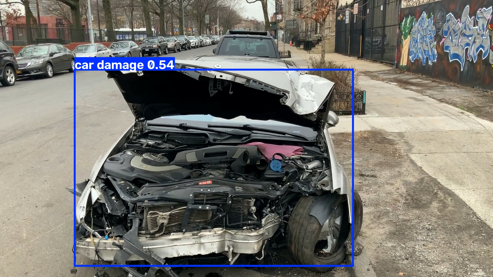
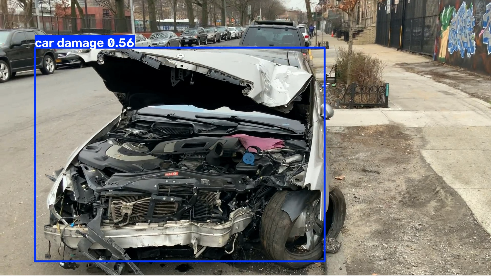
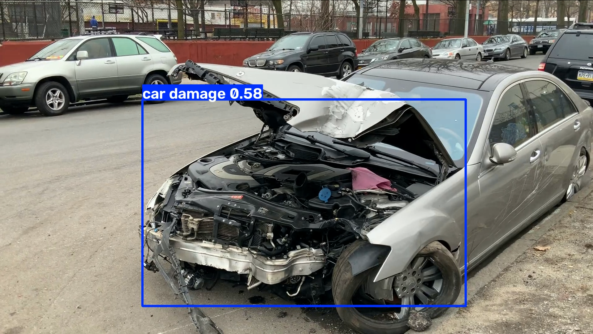

🚗 Vehicle Damage Detection using YOLOv8

A computer vision project that detects **vehicle damage** using a custom-trained **YOLOv8 Nano (YOLOv8n)** model. The model can perform inference on both **images** and **videos**, making it suitable for applications such as vehicle inspection, insurance claim assistance, and automated damage assessment.

---

✨ Features

* Detects vehicle damage using a custom-trained YOLOv8n model.
* Supports inference on **images** and **videos**.
* Displays bounding boxes with confidence scores.
* Lightweight model with fast inference.
* Built using Python, OpenCV, and Ultralytics YOLOv8.

---

📂 Project Structure

vehicle_damage_dataset/
│
├── assets/
│   ├── detection1.png
│   ├── detection2.png
│   ├── detection3.png
│   └── demo.gif
│
├── dataset/
├── videos/
├── outputs/
├── runs/
│
├── train.py
├── predict.py
├── predict_video.py
├── data.yaml
├── requirements.txt
├── README.md
└── .gitignore

---

🧠 Model

* Model: YOLOv8 Nano (`yolov8n`)
* Framework: Ultralytics YOLOv8
* Language: Python
* Inference Library: OpenCV

---

🗂️ Dataset

The model was trained on a custom vehicle damage dataset containing annotated images of damaged vehicles.

The dataset was split into:

* Training Set
* Validation Set
* Test Set

---

🛠️ Tech Stack

* Python
* YOLOv8 (Ultralytics)
* OpenCV
* PyTorch

---

🚀 Installation

Clone the repository:
```bash
git clone https://github.com/<your-username>/<your-repository>.git
cd <your-repository>
```
Install dependencies:
```bash
pip install -r requirements.txt

---

▶️ Train the Model

```bash
python train.py
```

---

🖼️ Image Inference

```bash
python predict.py
```

---

🎥 Video Inference

```bash
python predict_video.py
```
The processed video will be saved in the **outputs/** directory.

---

📸 Results

Sample Detections:







---

🎬 Demo

If you upload your processed video to GitHub, you can link it here or include a GIF preview in the `assets` folder.

---

🔮 Future Improvements

* Improve detection accuracy with a larger and more diverse dataset.
* Add separate classes (e.g. scratch, dent, cracked bumper).
* Deploy the model as a web application.
* Optimize for real-time edge deployment.
* Integrate object tracking for live video streams.

---

📄 License

This project is intended for educational and portfolio purposes.

---

👤 Author

Mohammed Ashfaq

If you found this project useful, consider giving the repository a ⭐.
